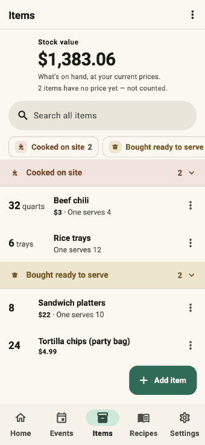
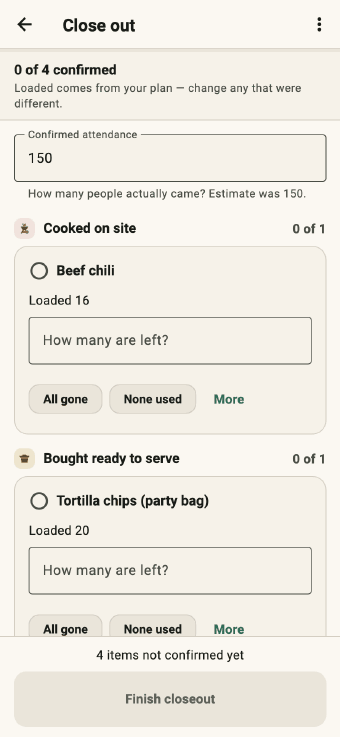
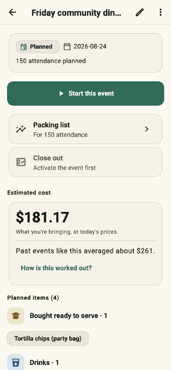

# Loadout

[](https://github.com/CoderOfTheLight/loadout/actions/workflows/ci.yml)


**A private, offline inventory and forecasting app for people who feed a crowd —
built end to end with a directed multi-agent AI workflow.**

Community kitchens, church halls and market stalls run on the same cycle: pack a
van, serve a few hundred people, then guess what to buy next time. Loadout
replaces the guess with what actually happened last time, and never sends any of
it anywhere — the Android release build ships with **no internet permission at
all**, and CI fails if that ever changes.

This repository is two things at once: a working v1 application, and a record of
how it was built. The engineering is real. So is the method — I planned it
first, directed specialist agents to build it, tested every release on a
physical phone, and let live failures drive the next round of work.

---

## The result, in one look

<table>
  <tr>
    <td align="center"></td>
    <td align="center"></td>
    <td align="center"></td>
  </tr>
  <tr>
    <td align="center"><b>Add what you have</b><br><sub>Four fields. One screen.</sub></td>
    <td align="center"><b>Count what came back</b><br><sub>One question per item.</sub></td>
    <td align="center"><b>See what it costs</b><br><sub>Totals as you pick.</sub></td>
  </tr>
</table>

<sub>These are not screen recordings. A test drives the real app — taps the real
buttons, types real text — and captures each frame, so the demo can never drift
from what the app actually does. Regenerate with
`LOADOUT_GIFS=1 fvm flutter test test/tooling/gif_capture_test.dart`.</sub>

**The loop the whole product serves:** organise supplies into folders → plan an
event and get a packing list → count what's left afterwards → next time is
better. Only step three teaches the forecast anything. Plans, estimates and
overrides never become evidence.

---

## How this was built

The theme of this repository is method. I did not sit down and prompt an AI to
"build an inventory app". I ran it like a project with an engineering team, and
the sequence mattered more than any individual prompt.

### 1. Plan before prompting

Before any code existed, I worked through the problem in depth: what the app was
for, who would actually hold the phone, which platform to target first, the data
model the forecasting honesty depended on, and the security posture — offline
only, encrypted at rest, no accounts. I wrote the reasoning down, and those
documents became the contract the build worked from rather than notes nobody
read again.

| Planning artifact | What it fixed in advance |
|---|---|
| [`PRODUCT_PLAN.md`](PRODUCT_PLAN.md) | Scope, the release contract, seven delivery gates |
| [`docs/adr/0001-authoritative-deterministic-core.md`](docs/adr/0001-authoritative-deterministic-core.md) | Why forecasting is deterministic and AI-free |
| [`docs/architecture/gates-2-3-design.md`](docs/architecture/gates-2-3-design.md) | The implementation contract: schema, write path, screens |
| [`docs/security/THREAT_MODEL.md`](docs/security/THREAT_MODEL.md) | What is protected, from whom, and what is not |

The most consequential decision was made here, on paper: **the forecast engine is
pure, deterministic, and frozen.** No AI touches a number a user relies on. That
constraint shaped everything downstream and never had to be revisited.

### 2. Build with directed agents, not a single conversation

I directed the build as a multi-agent workflow, assigning **specific models to
specific jobs** — heavier reasoning where architecture and correctness were at
stake, lighter and cheaper models for mechanical work — so effort and tokens went
where they changed the outcome.

Four practices did most of the work:

- **Contracts first.** Before parallel agents touched a feature, the interface
  between their halves was written and committed — the Swift↔Dart channel for
  the camera work, the money and prediction types for event costing. Agents
  building opposite sides of a boundary could not drift, because the boundary
  existed before they did.
- **Disjoint ownership.** Each agent got an explicit file territory and a list of
  what it must not touch. Four agents could rebuild four areas of the UI at once
  without stepping on each other.
- **Every agent gated on the same evidence.** Analyzer clean, formatter clean,
  and the entire test suite passing — not "my tests". Agents reported failures
  they believed belonged to a concurrent agent rather than "fixing" them blindly.
- **A lead agent that verifies, and a human who overrules.** I assigned the
  strongest model as lead: it wrote the contracts, reviewed and verified every
  other agent's work before it landed, and escalated to me — rather than
  guessing — whenever a decision, a conflict or an open question came up. That
  kept the expensive model on judgement and the cheaper ones on execution, and
  it meant I spent my attention on the calls that actually needed a person. One
  of them: when an audit recommended deleting per-item waste tracking from the
  counting screen to simplify it, I kept it. Waste is what separates *what sold*
  from *what got thrown out*, and losing it would have quietly corrupted every
  future forecast. Simplification is not automatically an improvement.

### 3. Test on real hardware, and let failures drive the plan

Every round was installed on a physical iPhone and used — not demoed. I ran real
counts, hit edge cases, and reported back what was broken, missing or confusing.
That loop found things no test suite had:

> **The white screen.** After one release the app opened to a blank screen and
> nothing else. It was root-caused from the device's own diagnostic log to a
> schema migration that had half-applied and left the database stranded between
> versions — invisible to tests, because tests migrated in-memory databases while
> the phone migrated a real encrypted file.
>
> The fix was not just the bug. Migrations became atomic and re-runnable, and a
> test now **recreates the exact stranded state** and proves the next launch
> recovers it. Every schema version since is covered the same way.

Live testing also produced most of the UI direction. "The new recipe form won't
let me select anything." "I don't get the new item form — a weight?" "The
closeout is still too complicated." Each of those became a round of work, and
each round went back on the phone.

### 4. Research the design, don't invent it

Rather than guessing at a visual language, I directed a research pass: what
Apple and Google's design systems actually specify today, and what the best
apps in adjacent categories — inventory, recipes, field checklists — genuinely
do. The findings became rules, not opinions:

- One saturated brand colour for everything interactive; all other colour
  belongs to the user's own data.
- Colour means **state** before anything else. Green is counted, amber is
  pending, red is short — and a hue that carries state is never decorative.
- Numbers are the content, so numbers get the size.

Then the audience constraint sharpened everything: the volunteers using this app
know Excel and Word, and not much else software. Screens were measured against
that standard and rebuilt. Adding an item went from **24 controls and 106 words
of helper text across three screens** to **five controls and eleven words on
one**. The counting screen went from an expandable worksheet labelled with an
algebra formula — `Worksheet (loaded − left over − waste)` — to a single
question: *how many are left?*

**The receipts:** [`docs/AI_WORKFLOW.md`](docs/AI_WORKFLOW.md) has the actual
orchestration artifacts — agent roles and the model class assigned to each, a
real task contract, how file ownership prevented four concurrent agents from
colliding, what the lead's verification pass consisted of, a failure the agents
missed entirely, a recommendation I overruled and why, and the acceptance
criteria a change had to meet before I took it.

### 5. Ship the story with the software

The final round produced this README, the demo reels above, and an honest
roadmap. A project an employer or a volunteer can understand in ninety seconds is
part of the deliverable, not an afterthought.

---

## Verified, not asserted

The privacy claims are enforced by CI against real build artifacts, which is the
only version of a privacy claim worth making:

| Gate in [`.github/workflows/ci.yml`](.github/workflows/ci.yml) | What it proves |
|---|---|
| `Assert no Android internet permission` | The release manifest cannot request network access |
| `Assert no network-capable packages` | No dependency can reach the network |
| `Assert no raw sockets or HttpClient in app code` | No code path opens a connection |
| `Assert SQLCipher source hook is configured` | The database is genuinely encrypted, not plain SQLite |
| `Assert Android backups disabled` | Data cannot leave via cloud backup or device transfer |
| `Assert no debugPrint in lib` | Kitchen data cannot leak into logs |
| `Assert committed drift schema dump is current` | The schema on disk matches the code |

Beyond CI, the app refuses to start rather than silently writing unencrypted
data if the encryption library is ever missing, and the diagnostic logger has
**nowhere to put free text** — it accepts event codes, counts and durations, and
nothing else.

**1,130 tests**, including some that are unusual and were worth the effort:
migration tests that upgrade real encrypted database files from every past
schema version through the production code path; contrast tests that measure
every text-and-background pair against WCAG 2.2 in both themes; route tests that
walk every screen at a real phone viewport across four workspace states,
asserting nothing overflows and no screen is a dead end; and text-scale tests at
200%, because this audience uses large text.

---

## Where it stands — and what's not done

This is **version 1: phones only.**

| | iOS 16+ | Android 10+ |
|---|---|---|
| Core app | ✅ | ✅ |
| Barcode scanning | ✅ | ❌ not yet |
| Recipe photo (OCR) | ✅ | ❌ not yet |
| Tested on physical hardware | ✅ | ⚠️ emulator only |

Both camera features degrade honestly on Android — the buttons don't appear,
rather than appearing and failing.

**It is not in an app store, and I would rather say why than imply otherwise.** A
readiness audit of the current code found the application itself in good shape
and the release surface untouched: no signing key, no privacy policy URL, no iOS
privacy manifest, and neither store's required artifact format ever built.
[`docs/RELEASE.md`](docs/RELEASE.md) carries the full checklist.

The functional gap that used to sit here — a failed start showing a blank screen
— is closed. A bootstrap failure now lands on a screen that says Loadout could
not start, promises plainly that nothing was changed or deleted, and offers the
ways out that exist: try again, restore from a backup file, or save the
diagnostics file so someone can look at it. If the encryption library is ever
missing the app still refuses to open your data rather than falling back to
storing it unprotected — but it now says so instead of vanishing.

---

## Quick start

Requires [FVM](https://fvm.app); the Flutter SDK is pinned to 3.44.7.

```bash
fvm install
fvm flutter pub get
fvm flutter test          # 1,130 tests
fvm flutter run           # connected phone or simulator
```

```bash
# Release builds
fvm flutter build ios --release
fvm flutter build apk --release

# Regenerate the demo GIFs and screenshots after a UI change
LOADOUT_GIFS=1 fvm flutter test test/tooling/gif_capture_test.dart
LOADOUT_SCREENS_OUT=/tmp/shots fvm flutter test test/tooling/screen_capture_test.dart
```

## Repository layout

```
lib/
  app/            theme, router, providers — the design system lives in theme.dart
  core/           exact arithmetic: quantities in micros, money in whole cents
  data/db/        Drift schema, migrations, the append-only tables and triggers
  features/       catalog, events, closeout, forecasting, recipes, backup, export
  infrastructure/ encrypted database open path, key management, startup recovery
ios/Runner/       Swift channels: Vision text recognition, AVFoundation barcodes
test/             1,130 tests, incl. migration, contrast, route and text-scale suites
test/tooling/     screenshot and GIF harnesses that render the real app
docs/             architecture notes, threat model, release checklist
```

Deeper reading: [architecture index](docs/architecture/README.md) ·
[data model](docs/architecture/data-model.md) ·
[forecasting](docs/architecture/forecasting.md) ·
[threat model](docs/security/THREAT_MODEL.md) ·
[how it was built](docs/AI_WORKFLOW.md)

## Roadmap

**Version 2 — desktop.** macOS, Windows and Linux, plus Android parity for
barcode scanning and recipe photos.

**Also planned:** a shareable count report, production planning (working
backwards from a menu to a prep schedule), and the release-readiness work above.

## Attribution

I planned this application, chose its architecture and security posture, directed
the multi-agent build, decided which models did which jobs, tested every release
on physical hardware, and made the product calls — including the ones that
overruled my own agents.

The implementation was written by AI agents working under that direction, from my
planning documents, against contracts I specified, and reviewed by me. The
forecasting mathematics, the offline and encryption posture, and the honesty
rules — never invent a number, never learn from a guess, always say what a total
leaves out — are design decisions I made and held.

Third-party components: Flutter and Dart, [Drift](https://drift.simonbinder.eu)
for the database layer, [SQLCipher](https://www.zetetic.net/sqlcipher/) for
encryption at rest, Apple's Vision and AVFoundation frameworks for on-device text
and barcode recognition. Everything else in `lib/` is this project's own.

## License

MIT — Hannah Stroble, 2026 — covers the application code and the documentation
in this repository. Flutter, Drift and SQLCipher are separately licensed by their
authors. See [LICENSE](LICENSE).
